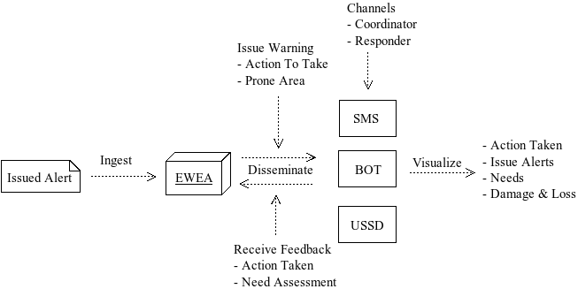

# ewea(WIP)

[](https://travis-ci.org/CodeTanzania/ewea)
[](https://david-dm.org/CodeTanzania/ewea)
[](https://coveralls.io/github/CodeTanzania/ewea?branch=develop)
[](https://github.com/CodeTanzania/ewea/blob/develop/LICENSE)

[](https://renovatebot.com/)
[](http://commitizen.github.io/cz-cli/)
[](https://github.com/prettier/prettier)
[](https://github.com/airbnb/javascript)

Emergency Early Warning, Early Action Toolkit.





## Requirements

- [NodeJS v12+](https://nodejs.org)
- [Npm v6+](https://www.npmjs.com/)
- [MongoDB v4+](https://www.mongodb.com/)
- [Mongoose v5.6+](https://github.com/Automattic/mongoose)

## Installations
> WIP

## Usage
> WIP

## Develop

- Clone this repository
```sh
$ git clone https://github.com/CodeTanzania/ewea.git
```

- Install dependencies

```sh
$ npm install
```

- Run development server

```sh
$ npm run start:dev
```

- Run test

```sh
$ npm test
```

## Contribute

It will be nice, if you open an issue first so that we can know what is going on, then, fork this repo and push in your ideas. Do not forget to add a bit of test(s) of what value you adding.

## License

The MIT License (MIT)

Copyright (c) CodeTanzania & Contributors

Permission is hereby granted, free of charge, to any person obtaining a copy of this software and associated documentation files (the “Software”), to deal in the Software without restriction, including without limitation the rights to use, copy, modify, merge, publish, distribute, sublicense, and/or sell copies of the Software, and to permit persons to whom the Software is furnished to do so, subject to the following conditions:

The above copyright notice and this permission notice shall be included in all copies or substantial portions of the Software.

THE SOFTWARE IS PROVIDED “AS IS”, WITHOUT WARRANTY OF ANY KIND, EXPRESS OR IMPLIED, INCLUDING BUT NOT LIMITED TO THE WARRANTIES OF MERCHANTABILITY, FITNESS FOR A PARTICULAR PURPOSE AND NONINFRINGEMENT. IN NO EVENT SHALL THE AUTHORS OR COPYRIGHT HOLDERS BE LIABLE FOR ANY CLAIM, DAMAGES OR OTHER LIABILITY, WHETHER IN AN ACTION OF CONTRACT, TORT OR OTHERWISE, ARISING FROM, OUT OF OR IN CONNECTION WITH THE SOFTWARE OR THE USE OR OTHER DEALINGS IN THE SOFTWARE.
